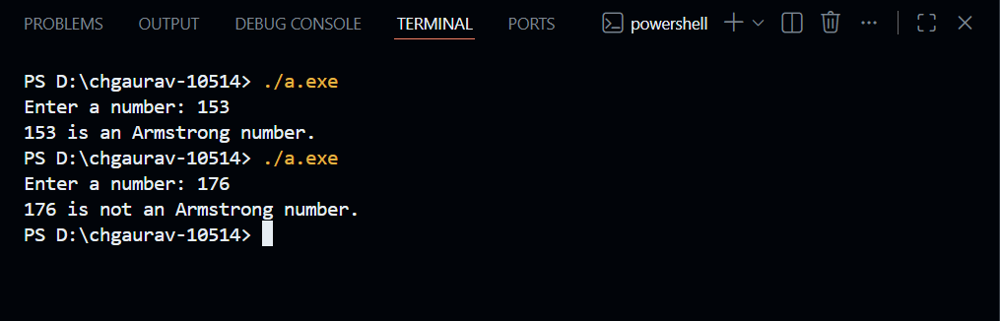

# Armstrong Number Program (C)

## 📌 Project Details
This project is developed as part of my **End Semester C Programming Project**.  
The program checks whether a given number is an **Armstrong Number** using the C programming language.

An Armstrong number is a number that is equal to the sum of its digits each raised to the power of the total number of digits.

Example:  
153 → 1³ + 5³ + 3³ = 153

---

## 🎯 Why I Did This Project
I did this project to:
- Improve my understanding of C programming basics
- Learn the use of loops, conditionals, and arithmetic operations
- Apply mathematical logic using programming
- Gain hands-on experience with a logical problem

---

## 🧠 What I Learned From This Project
From this project, I learned:
- How to extract digits from a number using modulus and division
- How to count digits in a number
- How to calculate power using loops
- Proper use of `while` loops
- Writing structured and readable C programs
- Basic usage of GitHub for project submission

---

## 🛠️ Utility of the Project
- Helps beginners understand number-based programming
- Useful for academic practice
- Improves logical thinking
- Can be used as a reference for similar problems

---

## 🚀 Future Scope
This project can be extended by:
- Checking Armstrong numbers within a given range
- Implementing the logic using functions
- Enhancing user interaction
- Converting the program into other programming languages
- Developing a graphical interface

---

## 🖥️ Output Screenshot
Below is the output of the program:

---

## 👨‍💻 Author
**Ch Gaurav**  
B.Tech – Computer Science 

